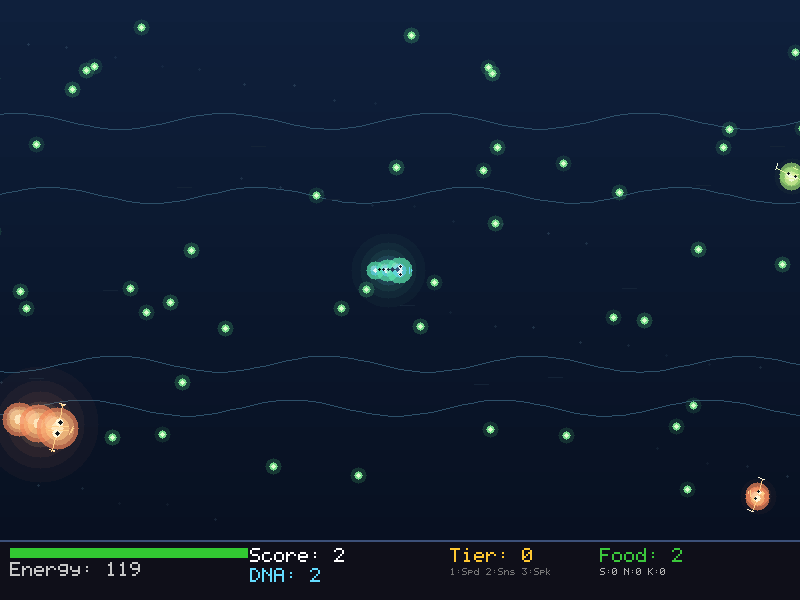

# Tidepool

[](https://github.com/InauguralSystems/Tidepool/actions/workflows/tests.yml)
[](https://securityscorecards.dev/viewer/?uri=github.com/InauguralSystems/Tidepool)
[](https://github.com/InauguralSystems/Tidepool/releases/latest)
[](LICENSE)

A Spore-inspired cell-stage evolution game written entirely in
[EigenScript](https://github.com/InauguralSystems/EigenScript) — and the cells
**learn to play it themselves.**

Eat, evolve, survive. Start as a single cell in the primordial pool. Consume
food, avoid predators, spend DNA on mutations, call a mate, and choose when to
evolve through five scale tiers.



## What makes it different

Spore's creatures ran on scripted AI. In Tidepool the cells learn: a neural
policy perceives the pool the way a player does — a 433-feature observation —
and is trained with a from-scratch DQN to feed, survive, and time its
evolutions. *"Spore's cell stage where you watch the cells evolve their brains,
written from scratch in a homemade language"* is the pitch. There is no
Python, JS, or native code here — the game, renderer, trainer, and editor are
all EigenScript.

## Features

- **Faithful cell stage** — diet choice, eat food and meat, spend DNA on
  mutations and unlockable parts (mouths, fins, claws, poison/electric/jet),
  call a mate, evolve through five scale tiers, dodge giant "epic" cells.
- **Evolution as a decision** — eating enough food *unlocks* the next tier, but
  evolving is a deliberate action: each tier summons a harsher world (more,
  stronger predators), so *when* to evolve is a real risk/reward call.
- **A learned brain** — a 433-input MLP policy trained by an in-language DQN
  (replay buffer, target net, manual backprop). Press **Tab** in-game to let
  the policy pilot the cell.
- **Bioluminescent renderer** — translucent glowing cells, a depth-graded pool,
  caustics, and drifting plankton, drawn through a headless-inspectable
  draw-list layer so frames can be tested without a display.

## Requirements

EigenScript v0.19.0 or later — the neural policy stores its weights as flat
shaped buffers (`#275`, v0.19.0), and background music needs the `audio_music_*`
builtins (v0.18.0) plus `libsdl2-mixer-2.0-0` at runtime. CI builds against the
pinned version in `.devcontainer/Dockerfile` (currently v0.21.2). Check it out
alongside this repo and build it:

```bash
git clone https://github.com/InauguralSystems/EigenScript.git   # ../EigenScript
cd EigenScript && make install-gfx
```

## Run

The Makefile builds the right binary from `../EigenScript` (override with
`EIGS_DIR=`) and works from any directory:

```bash
make run      # build the graphical binary and play
make test     # build the headless binary and run the test suite
make lint     # parse-check every source
make shot     # regenerate the gameplay screenshot headless (needs xvfb)
```

Or run directly: `/path/to/EigenScript/src/eigenscript tidepool.eigs`.

The repo ships a devcontainer (`.devcontainer/`) that builds a pinned EigenScript
from source, so it also opens in a [GitHub Codespace](https://codespaces.new/InauguralSystems/Tidepool)
with the toolchain ready — run `make test` / `make shot` there without a local setup.

## Controls

| Keys | Action |
|---|---|
| WASD / arrows | move |
| 1 / 2 / 3 | buy speed / sense / spikes (5 DNA each) |
| E | evolve (when eligible) |
| M | call a mate |
| Tab | watch mode — the AI plays |
| Esc | pause / back |

## Train and evaluate the AI

Training is headless (no display) and slow on an interpreter, so it runs
off-line:

```bash
EIG=../EigenScript/src/eigenscript
$EIG train.eigs --episodes 800 --seed 42          # -> models/policy.txt (+ train_log.csv)
$EIG train.eigs --episodes 800 --resume           # chain runs toward convergence
$EIG eval_policy.eigs --seeds 20 --ticks 1000     # trained vs autopilot vs random (mean ±95% CI)
```

`train_log.csv` logs `mean_tier` per block — the signal for whether the policy
is learning to evolve. See [CLAUDE.md](CLAUDE.md) for the full workflow.

## Contributing

Build and test with `make test` / `make lint`. The repo doubles as a real-world
EigenScript stress test — language gaps found during development are tracked in
[GAPS.md](GAPS.md) and driven upstream. See [CONTRIBUTING.md](CONTRIBUTING.md).

## License

MIT — see [LICENSE](LICENSE).
