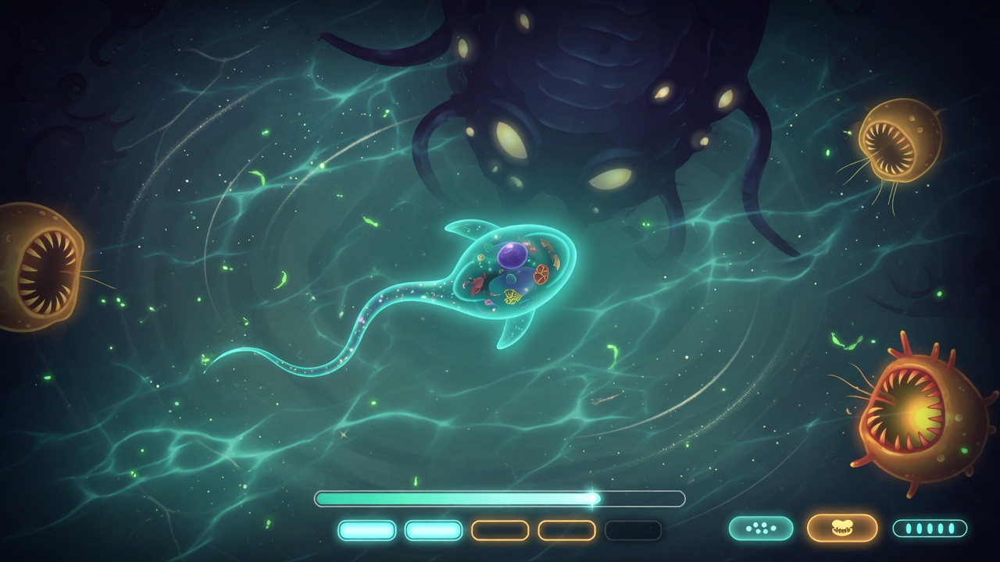

# Tidepool's external oracles — Spore Cell Stage and Thrive Microbe Stage

Tidepool is "Spore's cell stage where the cells learn their own brains". Two
shipped games are the yardstick for *what a cell stage is*: Spore's Cell
Stage (2008, the original) and Thrive's Microbe Stage (open source, the
scientific one). This file is the diff — what each has, what Tidepool has,
what Tidepool lacks — so a roadmap item can be judged against something that
already sells rather than against taste, and so the screenshot oracle (#59)
knows what a frame must show. Sources: the Spore wiki `Cell_Stage` page and
the Thrive wiki `Thrive` / `Microbe_Stage` pages (MediaWiki API, fetched
2026-09-20); Tidepool facts from `src/constants.eigs` and `README.md`.
Re-diff when either side moves.

## 1. Mechanics — Spore Cell Stage vs Tidepool

| Spore Cell Stage | Tidepool today | Gap |
|---|---|---|
| Diet choice: Filter Mouth (herbivore), Jaw (carnivore), Proboscis (omnivore, harvested mid-stage); what you eat moves a herb↔carn meter and decides the trait card | `MOUTH_FILTER / MOUTH_JAW / MOUTH_PROBOSCIS`; diet choice at start | no diet meter, no end-of-stage consequence card |
| Movement parts: Flagella (15 DNA), Cilia (15, fast turns, lvl 3), Jet (25, 2× speed in bursts, lvl 2) | `APPENDAGE_FIN`, `APPENDAGE_CILIA`, `APPENDAGE_JET`; "speed" buyable for 5 DNA | part costs are flat 5 DNA (Spore 10–25, DNA cap 65); no stacking-with-diminishing rule |
| Weapons: Spike (10, ram; spike-vs-spike cancels, spike beats jaw), Poison (15, trailing cloud, immunity to poison), Electric (25, periodic shock 5–10 s recharge, immunity, the only epic-killer) | `APPENDAGE_CLAW`, `APPENDAGE_POISON`, `APPENDAGE_ELECTRIC`; directional combat via `BODY_ZONE_FRONT/SIDE/REAR` | claw ≠ spike semantics (no ram-vs-jaw table); no immunities; electric not an epic counter |
| Sight: Beady/Stalk/Button eyes (5 DNA each); without eyes vision is a small radius, meteors still visible | "sense" buyable for 5 DNA (radius) | eyes as parts with a visible vision radius; the no-eyes darkness |
| 4 size classes: prey (one-hit), peer (3 meat), predator (immune to mouths; spikes/poison/electric hurt it), epic (only electric; each epic has a named weakness) | predators scale with tier (`4→5→7→8→10`), `MAX_EPIC_CELLS 2` patrol at `EPIC_RADIUS 4.0` | no prey/peer/predator classes by size; no per-epic weakness |
| Growth: ~10 levels, 5 denoted by dividers on the progress bar; each spurt zooms out — peers become prey, background giants enter play; player turns opaque at level 4 | `SCALE_TIER_COUNT 5`, unlock at `(T+1)*FOOD_PER_TIER`, evolving is a deliberate action (harsher world per tier) | zoom-out / relative-size change is the *visible* promise of a tier; opacity-by-tier |
| Kills explode into 1–4 meat chunks (poison/electric kills flip over instead and must be bitten); meat too big must be cut with spikes | `MAX_MEAT 48`; meat entity exists | chunk count / size scaling per level; the "flip over" state |
| Parts arrive by meteor shard (swim over) or by killing a cell that has the part (golden shield marks it) | `PART_DROP_CHANCE 25`, `PART_DROP_LIFETIME 900`, generic drops | parts tied to specific carriers; meteor shards as objects |
| 28 named NPC cells (Minno … Bloato), each level introduces named ones; Maa/Paa lay eggs → Junior swarms | `MAX_SPECIES 8`, procedurally parameterised | named/recognisable species per tier; eggs and swarms |
| World objects: small plants, large plant flakes, seaweed with obstacles, crystals/debris/shells as barriers, bubbles, currents (ripples; with/against flow), poison clouds, sparks | food (`MAX_FOOD 52`), water current (`game.current_angle`), plankton, caustics | plants as structures, barriers, bubbles, visible current ripples, hazard clouds |
| Health 6 HP for every cell; damage tables per part | HP exists (`GAME_OVER_CONSUMED / STARVED / EPIC`) | starvation is Tidepool-only (Spore has no hunger death) — keep; document |
| Missions (top-left instructions): eat 5, collect all parts (Completist) | none | a first-minute objective |
| Mate call → Cell Editor (stackable parts, placement matters) | `M` calls a mate; `editor.eigs` | placement-as-strategy (spikes front to ram, sides to defend) |
| Cutscene: comet → brain → trait card → Creature Stage | none | the "brain" moment — in Tidepool the brain is literal (the trained policy); there is a story beat here nobody else can tell |
| Difficulty settings alter NPC aggression | none | — |
| Scripted NPC AI | **learned policy (433-feature obs, in-language DQN); Tab = watch mode** | Tidepool's moat; Spore has nothing here |

## 2. Mechanics — Thrive Microbe Stage vs Tidepool

Thrive is the other axis: simulation over arcade.

| Thrive Microbe Stage | Tidepool today | Gap / note |
|---|---|---|
| Compounds: glucose (and others) → ATP; osmoregulation, movement, engulfing and organelles all cost ATP; ammonia + phosphate to reproduce | food → DNA; starvation | an energy economy with a running cost (osmoregulation) is the single mechanic that makes idling lethal — Tidepool's starvation is the arcade version of it |
| Organelle editor on reproduce; species (yours and NPC) speciate each generation; auto-evo of NPC species | parts editor on mate call; NPC species fixed per run | NPC evolution across a run — Tidepool already trains a brain; evolving NPC *bodies* is the same machinery pointed outward |
| Patches/biomes map (volcanic vents …), compound clouds coloured by type | one pool | — |
| Engulfing (G, flash blue, slower), pili puncture, toxins (E) with Oxytoxisome; membrane types change damage | claw/poison/electric, body zones | engulf = eat-whole for bigger-than-prey is missing |
| Colonies via binding agents → multicellular | none (out of scope: Tidepool is one stage) | — |
| Population/extinction: species dies at 0 pop; win at ≥300 pop over 20 generations | single-cell run; game over | a species-level score across episodes would fit the trainer's episode loop |
| Death → take over another cell of your species with default reserves | game over | respawn-as-species |

## 3. What a screenshot must show — the oracle for #59

The visual bar is a picture, not an adjective: `docs/concept-2026-09-20.png`
(generated 2026-09-20 from the brief in this section's terms — same identity as
today's `screenshot.png`, rendered as a modern game). Every renderer change is
judged as a diff toward it.

A headless frame (`make shot`) of a mid-run tier-2 cell should contain, and a
structural check can assert:

1. Top-down pool with a depth gradient, caustics and drifting plankton
   (already the renderer's promise).
2. The player cell, translucent, with its parts visible where they are
   placed (mouth type, appendages by zone) — opacity/size should differ
   between tier 0 and tier 4 frames.
3. Food particles (plant, meat) and at least one predator of a *different
   size class*, and an epic cell at the edge or in the background.
4. HUD: DNA count, a tier progress bar with **five dividers**, HP, and an
   evolve-eligible indicator; a herb↔carn diet meter once it exists.
5. Visible hazards when the parts exist: a poison trail, electric sparks.
6. Visible current: ripples or a drift direction.
7. A part drop or meteor shard on screen at least some of the time.

Assert on the draw-list (the renderer is headless-inspectable) rather than
on pixels where possible: counts of entity kinds drawn, HUD strings present,
opacity value of the player sprite, palette entries used. Pixel goldens
drift; draw-list structure does not.

## 4. Where Tidepool is ahead

- The learned brain (no oracle has it). The "brain" cutscene in Spore is a
  *story* about what Tidepool actually *does* — that is the pitch, and the
  frame that shows it (watch mode, policy piloting) is the screenshot to
  lead with.
- Evolving as a deliberate risk decision (Spore's is automatic on the bar).
- Starvation as a live cost (Thrive's osmoregulation, arcade-sized).
- Everything is one language, headless-testable, deterministic under the
  tape — the oracle games cannot replay a run byte-exactly.
- **The floor is a potato, so every player is above it.** Tidepool is
  developed and gated on an ASUS X540NA — Intel Celeron N3350 @ 1.10 GHz,
  2 cores, 3 GB usable RAM, integrated HD Graphics 500 — and
  `benchmarks/BASELINE.md` is measured there (~1.7 ms/tick). The Bibites'
  *minimum* is a Core i3 with 4 GB and it recommends an i5 with 8 GB; Thrive
  is a Godot 3D game. Whatever "modern" look M9 buys must keep running on
  this box at full speed — that constraint is the distribution advantage,
  not a limitation to apologise for (maintainer, 2026-09-20). The min-spec
  claim in any README must be derived from a `test_frametime.eigs` run on
  this machine, never typed. And the pressure flows upstream: a frame
  Tidepool cannot afford here is an EigenScript issue, not a Tidepool
  workaround — `GAPS.md` GAP-004 (inner-loop call cost, found on this box)
  is what forced the bytecode VM + JIT (v0.12.0) and the `nearest_in_range`
  builtins. The potato makes the game work; the game makes the language
  better (maintainer, 2026-09-20).

## 5. Suggested order (diff-and-beat: the smallest visible gap first)

1. Zoom-out on tier change + opacity-by-tier (§1 row 6) — the one thing a
   player *sees* a tier do; cheap in the renderer.
2. Prey/peer/predator/epic size classes with the "predator is immune to
   mouths" rule — turns the tier dial into legible danger.
3. A diet meter and an end-of-run card — gives a run a *result* besides a
   score, and the trainer a second reward channel.
4. Named species per tier (8 already parameterised) with one part each
   that only they carry — makes "harvest the part" a goal.
5. Eyes as parts with a vision radius — the observation window the policy
   already has becomes a thing the player buys.

## 6. The editor — Spore's Cell Editor and Thrive's Multicellular editor as references

Two reference frames (shared by the maintainer 2026-09-20; described here,
not committed — EA's and Revolutionary Games' images stay theirs; see the
Spore wiki `Cell_Editor` and Thrive's `Multicellular_Stage` concept art):

**Spore Cell Editor** (screenshot, "Karlets", Carnivore, 191 DNA): a
three-column parts palette on the left (12 parts as icons: flagella, jaw,
filter, proboscis, eyes ×3, spike, cilia, poison sac, electric, jet); the
cell in the centre, top-down, on a lit concentric-ring petri dish over a
blurred microscope backdrop; parts are placed **on the body** with mirrored
symmetry (two eyes, two flagella, a claw at the front); build/paint tool tabs
at the top; diet label with icon top-right; view/camera toggles right; name
field, DNA counter, undo/redo, cancel/accept along the bottom. Everything is
a picture; the only text is the name, the diet and the number.

**Thrive Multicellular editor** (concept art): tabs Report / Patch Map /
Editor; sub-tabs Structure / Membrane / Behaviour / …; parts placed on a
**hex grid**; an **Organism Statistics** panel on the right (speed, HP,
size, mass, ATP production vs consumption per process — every part has a
cost the panel shows live); cells translucent with organelles visible; the
progression frames show single cell → two joined → a colony with a
"strategic shape" → cells sorted into coloured categories → a 3D organism
with organs → parts added — captioned "still translucent". That last caption
is Tidepool's identity too.

**Tidepool's editor today** (`src/editor.eigs`, 334 lines, lib/ui): a
`CREATURE EDITOR` title; a left `PARTS` panel of **text buttons** (one per
part name); a centre `PREVIEW` panel with a custom-drawn cell; a right
`PROPERTIES` panel of dropdowns/sliders (Palette, Shape, Segments, Pattern,
Mouth); Done / Cancel. Part buttons toggle appendages on socket pairs
(`spec.body_segments * 2` sockets); unlocks are bitmasks.

| Reference | Tidepool | Gap |
|---|---|---|
| Parts are icons in a grid | text buttons in a column | needs an icon per part (the image path, EigenScript #1216, or procedural glyphs drawn with the part's own renderer) |
| Parts placed by dragging onto the body, mirrored | toggle on/off per socket pair | placement as a spatial act — click a socket on the preview; mirror by default |
| Live cost: DNA counter changes as you place; Thrive shows every stat live | properties apply on Done | a live stats strip (speed, sense, defence, DNA left) updated per change |
| Cell drawn large, lit, on a dish; organelles visible | small preview | the preview IS the screen; light it; draw the inside |
| Undo / redo | none | one-step undo at minimum |
| Diet shown as a label + icon | Mouth dropdown | diet as an outcome of the mouth choice, shown, not selected |
| Name field | none | a name is what makes it *your* cell |
| Tabs for build vs paint (Spore) / Structure vs Membrane vs Behaviour (Thrive) | one page | paint (palette/pattern) separated from build |

Order (smallest visible win first): live stats strip → click-to-place on
the preview with mirroring → parts as glyphs → undo → name + diet badge →
build/paint tabs.

## 7. The modern oracles (2025–26) — Spore is 2008; the bar is what sells now

Maintainer, 2026-09-20: "even Spore is outdated" — and "thrive". So the
oracle set is re-ranked:

**Primary — Thrive 1.0 (Revolutionary Games, Microbe Stage *complete*,
December 2025; open source, GPL, Godot/C#, `github.com/Revolutionary-Games/Thrive`).**
The look and the mechanics bar. It is readable source, not just
screenshots: membrane rendering (shader-based, per membrane type), organelle
placement on a hex grid, compound clouds coloured by type, patch map with
population dots, terrain chunks with baked ambient occlusion, a live
Organism Statistics panel, auto-evo that scores speed / turning / toxins /
health / compound budgets, patch events (runoff, upwelling, dilution),
sound tied to movement speed, graphics presets. Nine stages planned;
Multicellular next (they estimate a year). §2 and §6 above are diffed
against this game.

**Pitch competitor — The Bibites: Digital Life (Steam Early Access since
2025-03-04, $9.99, 96% positive of 218 reviews, one developer since 2017).**
This is Tidepool's own pitch, on sale: creatures with **neural-network
brains**, procedural appearance from genes, energy-conserving physics and
metabolism, pheromones, natural selection in real time, an editor to
engineer brains and genes by hand, family trees and population graphs,
challenge levels against bosses with community leaderboards. Art is
retro/pixel — *not* the visual bar. The diffs that matter:

| The Bibites | Tidepool | Who wins |
|---|---|---|
| brains **evolve** (custom evolutionary algorithm, population-scale) | one brain **trained** (DQN, 433-feature obs) and the player plays alongside it | different claims; Tidepool's is playable, theirs is watchable — both are needed to "watch cells evolve their brains" (see §2: NPC bodies/brains evolving per run is the same machinery pointed outward) |
| analysis tools: family tree, population stats, brain inspector | `train_log.csv`, `eval_policy` — off-screen | an in-game brain/lineage view is a feature they sell and we have the data for |
| sandbox: tune physics/biology parameters | constants in `constants.eigs` | expose a few as in-game sliders (a "world" tab in the editor, §6) |
| challenge levels + leaderboards | none | runs already have a score; a seeded challenge is one file |
| deterministic replay | **byte-exact tape replay of a whole run** | Tidepool — nobody else can replay a run bit-for-bit or diff two policies on the same seed |

**Also current, not oracles:** *Cell to Singularity* (idle/clicker, big
2025 rework — different genre), *Species: ALRE* (observation-only sim),
*Sporigins* (itch, Spore-cell homage, small). *Osmos* (2009) remains the
reference for ambient minimalism in a cell game; *Ori* / *Hollow Knight* /
*Abzû* for painterly bioluminescent light — the concept frame in §3 is in
that register.

Rule for this file: a look reference must be a game people are buying
today; a mechanics reference may be older. Re-rank when Thrive's
Multicellular ships.
